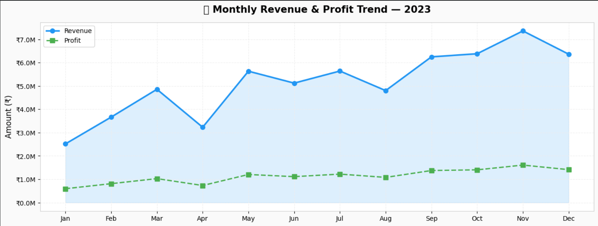
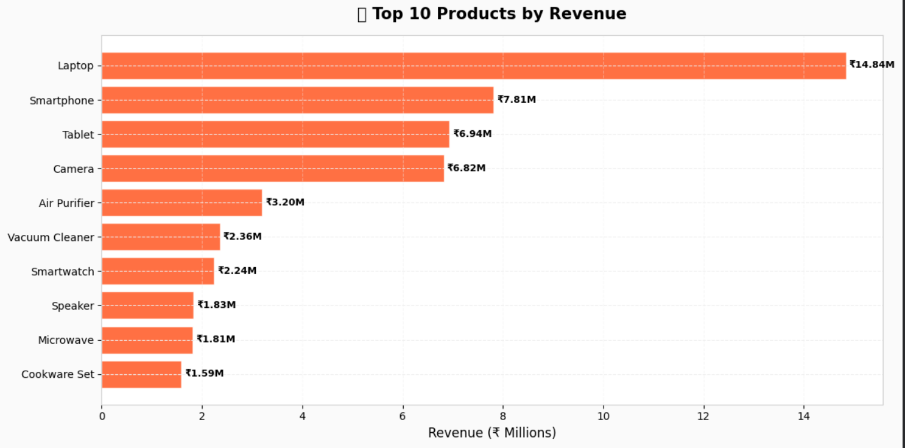
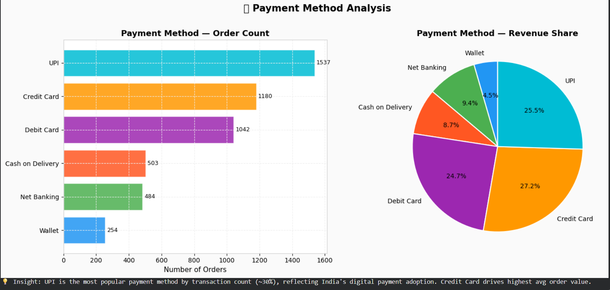
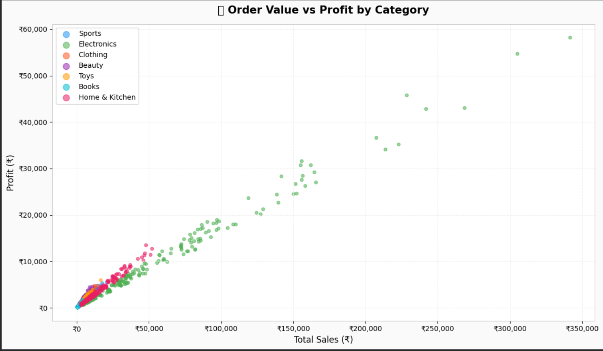

# 📊 E-Commerce Sales Analytics Project

An end-to-end **Data Analytics Project** built using **Python, Pandas, Matplotlib, and SQL** to analyze e-commerce sales data and generate business insights.

This project demonstrates:
- Data Cleaning
- Exploratory Data Analysis (EDA)
- SQL-based Business Analysis
- Data Visualization
- KPI Tracking
- Business Recommendations

---

# 🚀 Project Overview

The objective of this project is to analyze e-commerce sales data and identify:

- Top-selling products
- Monthly revenue trends
- Customer purchasing behavior
- Regional sales performance
- Payment method preferences
- High-profit categories
- Seasonal sales trends

The project simulates a real-world business scenario where data analysts help companies make data-driven decisions.

---

# 🛠️ Technologies Used

- Python
- Pandas
- NumPy
- Matplotlib
- SQLite3
- Google Colab
- Jupyter Notebook

---

# 📂 Project Structure

```bash
ecommerce-sales-analytics/
│
├── data/
│   └── ecommerce_sales_data.csv
│
├── notebook/
│   └── ecommerce_sales_analysis.ipynb
│
├── sql_queries/
│   └── business_queries.sql
│
├── images/
│   ├── monthly_revenue_profit.png
│   ├── top_products_revenue.png
│   ├── payment_method_analysis.png
│   └── order_value_vs_profit.png
│
├── README.md
├── requirements.txt
└── LICENSE
```

---

# 📈 Features

✅ Data Cleaning & Preprocessing  
✅ Exploratory Data Analysis (EDA)  
✅ SQL Integration using SQLite  
✅ 10+ Business SQL Queries  
✅ Professional Data Visualizations  
✅ KPI Analysis  
✅ Revenue & Profit Insights  
✅ Customer & Regional Analysis  

---

# 📊 Dataset Information

The dataset contains:

- 5,000+ sales records
- Multiple product categories
- Regional sales data
- Payment methods
- Revenue and profit metrics

### Dataset Columns

| Column Name | Description |
|-------------|-------------|
| Order_ID | Unique order identifier |
| Customer_Name | Customer details |
| Product | Product purchased |
| Category | Product category |
| Price | Product price |
| Quantity | Number of units ordered |
| Total_Sales | Final sales amount |
| Discount | Discount applied |
| Profit | Profit generated |
| Order_Date | Purchase date |
| Region | Sales region |
| Payment_Method | Payment type |

---

# 🧹 Data Cleaning Steps

- Removed duplicate records
- Handled missing values
- Converted date columns
- Fixed data types
- Created additional analytical features

---

# 🗃️ SQL Analysis

SQLite was integrated into the project to perform business queries.

### SQL Concepts Used

- SELECT
- WHERE
- GROUP BY
- HAVING
- ORDER BY
- LIMIT
- Aggregate Functions
- Subqueries
- Window Functions

### Example SQL Query

```sql
SELECT Category, SUM(Total_Sales) AS Revenue
FROM ecommerce_sales
GROUP BY Category
ORDER BY Revenue DESC;
```

---

# 📉 Data Visualizations

The project includes multiple visualizations to identify trends and business insights.

---

# 📷 Project Screenshots

## 📈 Monthly Revenue & Profit Trend



Shows monthly business growth trends and seasonal sales performance.

---

## 🛒 Top 10 Products by Revenue



Highlights the highest revenue-generating products.

---

## 💳 Payment Method Analysis



Analyzes customer payment preferences and revenue distribution.

---

## 📊 Order Value vs Profit by Category



Shows the relationship between revenue and profitability across categories.

---

# 📌 Key Insights

- Electronics generated the highest revenue.
- UPI was the most frequently used payment method.
- Revenue peaked during festive months.
- Discounts increased sales volume but reduced profit margins.
- West region contributed the highest overall revenue.

---

# 💡 Business Recommendations

- Increase inventory during festive seasons.
- Focus marketing campaigns on high-performing regions.
- Optimize discount strategies to maintain profitability.
- Promote high-margin product categories.
- Improve customer retention through targeted offers.

---

# ▶️ How to Run the Project

## 1. Clone Repository

```bash
git clone https://github.com/your-username/ecommerce-sales-analytics.git
```

## 2. Open Notebook

Open:

```bash
notebook/ecommerce_sales_analysis.ipynb
```

using:
- Google Colab
- Jupyter Notebook

---

## 3. Install Dependencies

```bash
pip install -r requirements.txt
```

---

## 4. Run All Cells

The dataset will load automatically and generate all analyses and visualizations.

---

# 📚 Future Improvements

- Interactive dashboard using Power BI
- Streamlit web application
- Machine learning sales prediction
- Customer segmentation analysis
- Real-time business analytics

---

# 🧠 Skills Demonstrated

- Data Cleaning
- Data Visualization
- SQL Querying
- Business Analysis
- Exploratory Data Analysis
- Problem Solving
- Data Storytelling

---

# 👨‍💻 Author

Pratik Pawar

Computer Science Engineering Student  
Aspiring Data Analyst | Python | SQL | Data Analytics

---

# ⭐ Support

If you found this project useful, consider giving it a ⭐ on GitHub!

---
